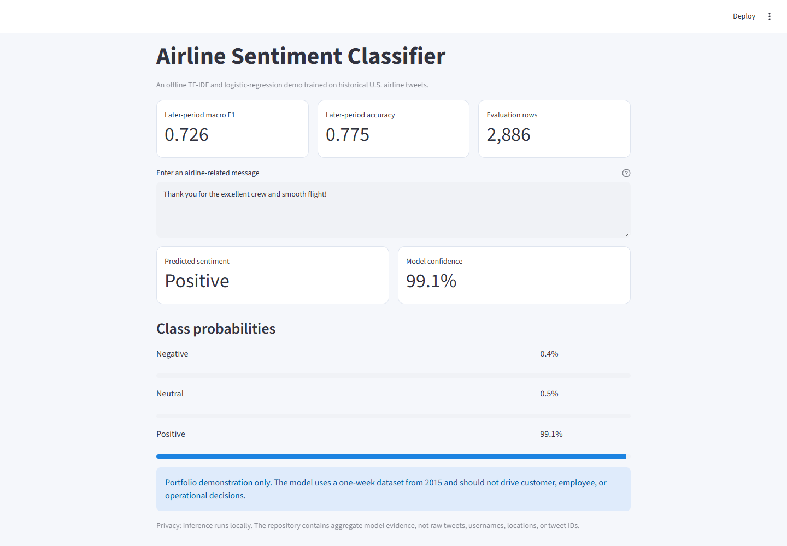
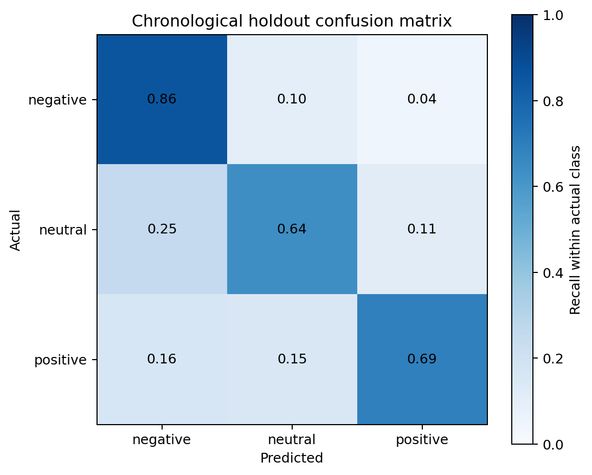
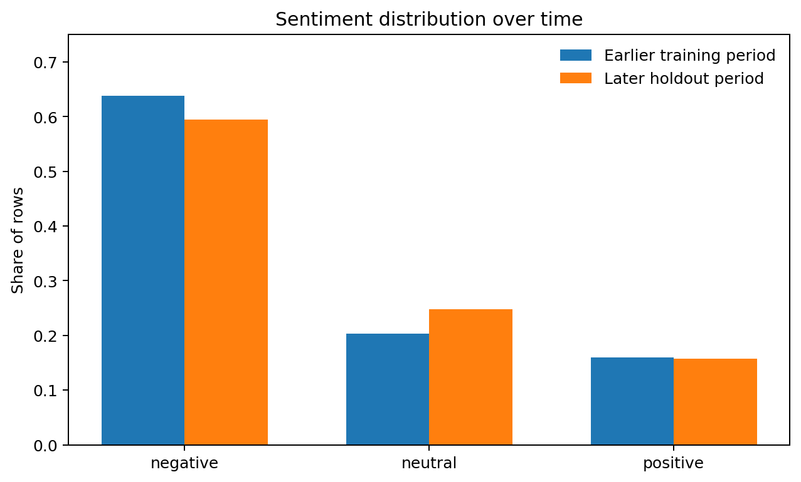
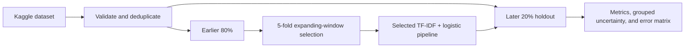

# Airline Sentiment Classifier

[](https://www.python.org/)
[](LICENSE)

A leakage-aware multiclass NLP benchmark for U.S. airline tweets. The project
compares a majority baseline, Complement Naive Bayes, and class-balanced
logistic regression using TF-IDF features, then evaluates the selected model on
strictly later messages.





## Why This Version Is Different

The original university exercise used one random train/test split and weighted
F1. This portfolio version makes the evaluation harder and more useful:

- Removes duplicate tweet IDs and duplicate text before splitting.
- Reserves the latest 20% of rows as a chronological holdout.
- Tunes TF-IDF and models with expanding-window cross-validation.
- Selects models by macro F1 so minority classes matter.
- Compares against an explicit majority-class baseline.
- Evaluates only the CV-selected winner on the final holdout.
- Bootstraps uncertainty by author rather than treating every tweet as
  independent.
- Reports performance separately for previously seen and unseen authors.
- Publishes aggregate artifacts only; raw tweets and direct identifiers stay
  out of Git.

## Results

The selected model is class-balanced logistic regression with word unigram and
bigram TF-IDF features.

| Model | Expanding-window CV macro F1 | CV weighted F1 | CV accuracy |
|---|---:|---:|---:|
| Logistic regression | **0.717** | **0.786** | **0.785** |
| Complement Naive Bayes | 0.705 | 0.777 | 0.780 |
| Majority baseline | 0.261 | 0.512 | 0.648 |

On the single-use later holdout, the selected model reaches **0.726 macro F1**
and **0.775 accuracy**. Its author-grouped 95% intervals are **0.707-0.744**
and **0.759-0.791** respectively. Per-class F1 is 0.854 for negative, 0.645 for
neutral, and 0.679 for positive sentiment.

Macro F1 is 0.720 for 504 messages from authors present in training and 0.727
for 2,382 messages from previously unseen authors. Neutral language remains the
largest weakness.



## Evaluation Design



The holdout begins seven seconds after the training period ends. It therefore
tests later messages from the same one-week collection, not performance in a
different year or platform.

## Quick Start

Requirements: Python 3.11 and [uv](https://docs.astral.sh/uv/).

```powershell
git clone https://github.com/AfifFarihin/airline-sentiment-classifier.git
cd airline-sentiment-classifier
uv sync --extra demo --extra notebooks --group dev
uv run python scripts/download_data.py
uv run airline-sentiment
uv run streamlit run demo/app.py
```

The downloader retrieves the upstream Kaggle archive, extracts only
`Tweets.csv`, and verifies its SHA-256 checksum.

## Repository Layout

```text
src/airline_sentiment/   Reusable data, modelling, training, and CLI code
demo/                    Offline Streamlit text-prediction interface
scripts/                 Verified data download and notebook generation
notebooks/               Portfolio analysis built from aggregate artifacts
outputs/metrics/         Model comparison, class report, uncertainty, features
outputs/figures/         Privacy-safe evaluation figures
tests/                   Data contracts, leakage guards, and artifact checks
```

## Checks

```powershell
uv run ruff check demo src scripts tests
uv run pytest -q
uv run pip-audit --skip-editable
```

## Data and Responsible Use

The raw Twitter US Airline Sentiment dataset is not committed. It is available
from Kaggle under CC BY-NC-SA 4.0. The source includes public tweet text,
usernames, and locations; this repository publishes none of those fields.
Usernames are pseudonymized in memory only for grouped uncertainty and
seen-versus-unseen-author evaluation; they are never model features.

This is a historical portfolio benchmark, not a production customer-monitoring
system. See [DATA_LICENSES.md](DATA_LICENSES.md) and
[MODEL_CARD.md](MODEL_CARD.md) for provenance, intended use, and limitations.

## Author

Developed by [AfifFarihin](https://github.com/AfifFarihin) from a university
text-analytics exercise, then rebuilt as a reproducible NLP portfolio project.

## License

Original code and documentation are released under the [MIT License](LICENSE).
The upstream dataset retains its CC BY-NC-SA 4.0 terms.
